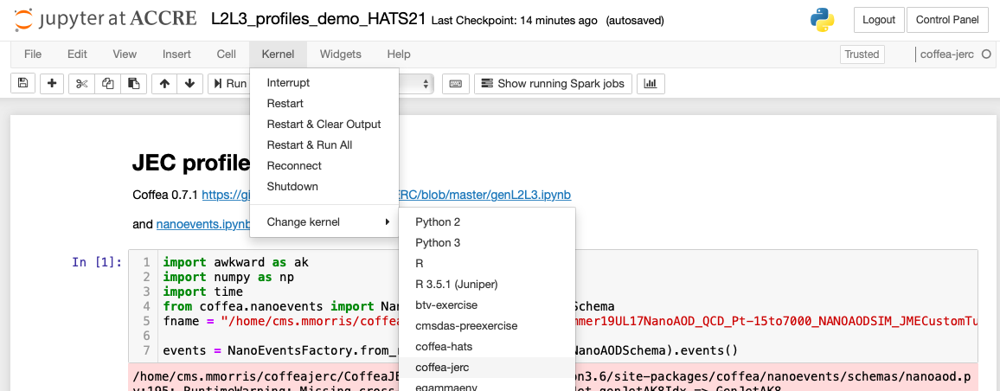

# CoffeaJERC Tutorial - HATS 2021

Sign into ACCRE:

https://jupyter.accre.vanderbilt.edu/

Open a terminal and get a voms ticket

```
voms-proxy-init -voms cms
```


Make a new directory for the HATS tutorial

```
mkdir CoffeaJERCHATS
cd CoffeaJERCHATS
```

Clone this repository

```
git clone https://github.com/mdmorris/CoffeaJERC
cd CoffeaJERC
```

Run the setup-environment.ipynb notebook

Open the L2L3_profiles_demo_HATS21.ipynb notebook and change the kernel to `coffea-jerc`



Run L2L3_profiles_demo_HATS21.ipynb


#
#

# CoffeaJERC Tutorial - LPC

## Run the notebook coffea-dask-join.ipynb on the LPC

```
ssh -L localhost:8888:localhost:8888  <user>@cmslpc-sl7.fnal.gov
```

Then get a voms ticket:

```
voms-proxy-init -voms cms
```

Create a directory in your nobackup area to run this exercise:


```
mkdir ~/nobackup/CoffeaJERC/
cd ~/nobackup/CoffeaJERC/
```

We will then run the following commands to set up the lpc_dask and Coffea environment

1. ```curl -OL https://raw.githubusercontent.com/CoffeaTeam/lpcjobqueue/main/bootstrap.sh```

2. ``` bash bootstrap.sh ```

3. ```./shell```

4. At this point you will be in your singularity container. Exit the singularity container with the command ```exit```

5. ```cp -r /uscms_data/d3/ncsmith/dazsle/boostedhiggs/.local/share/jupyter/kernels .local/share/jupyter/```

6. ```git clone https://github.com/mdmorris/CoffeaJERC/```

7. ```./shell```

8. Now you will be in your singularity container again. Open a jupyter notebook with the command: 

```jupyter notebook --ip 0.0.0.0 --no-browser --port=8888```


The output from all of these commands should look similar to the output below:


```
$ curl -OL https://raw.githubusercontent.com/CoffeaTeam/lpcjobqueue/main/bootstrap.sh
  % Total    % Received % Xferd  Average Speed   Time    Time     Time  Current
                                 Dload  Upload   Total   Spent    Left  Speed
100  1312  100  1312    0     0   3318      0 --:--:-- --:--:-- --:--:--  3321

$ bash bootstrap.sh
Wrote shell and .bashrc to current directory. You can delete this file. Run ./shell to start the singularity shell

$ ./shell
Installing shallow virtual environment in /srv/.env...
Installed kernelspec python3 in /srv/.local/share/jupyter/kernels/python3
done.

Singularity> quit

$ cp -r /uscms_data/d3/ncsmith/dazsle/boostedhiggs/.local/share/jupyter/kernels .local/share/jupyter/

$ ./shell

Singularity> jupyter notebook --ip 0.0.0.0 --no-browser --port=8888

[C 11:23:05.656 NotebookApp] 
    
    To access the notebook, open this file in a browser:
        file:///srv/.local/share/jupyter/runtime/nbserver-6621-open.html
    Or copy and paste one of these URLs:
        http://cmslpc169.fnal.gov:8888/?token=cd3b09ea36536befc848b0ee1647c3a21d799ef2adf2983c
     or http://127.0.0.1:8888/?token=cd3b09ea36536befc848b0ee1647c3a21d799ef2adf2983c


```

Copy the url from your output:

```
http://127.0.0.1:8888/?token=cd3b09ea36536befc848b0ee1647c3a21d799ef2adf2983c
``` 
and enter it in a browser.

Run the notebook coffea-dask-join.ipynb
